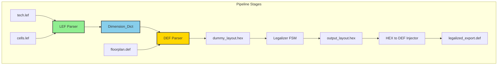
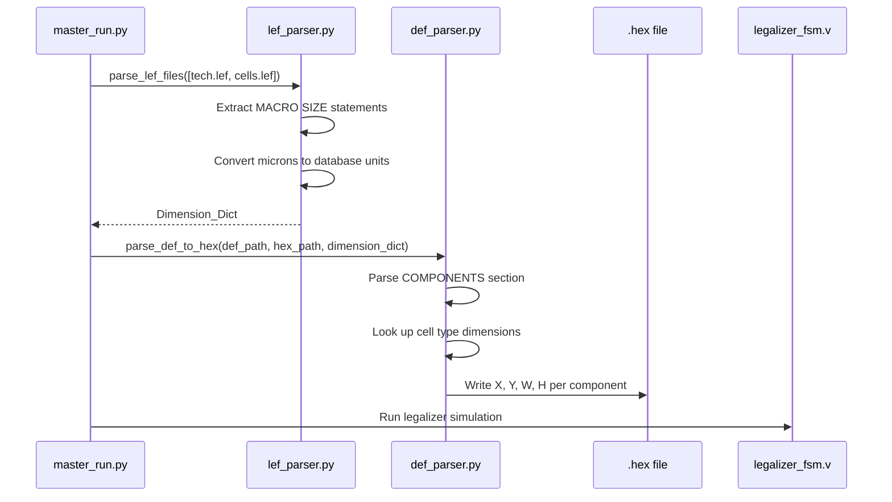

# Design Document: LEF Parser for Real Cell Dimensions

## Overview

This design document describes the implementation of a LEF parser module that extracts real cell dimensions from Library Exchange Format files, enabling physically accurate collision detection in the RTLign hardware legalizer. The current pipeline uses hardcoded 100×100 placeholder dimensions, causing incorrect overlap calculations for real cell geometries which can be tall and thin (e.g., 204.8×2.0 microns in ISPD 2015 benchmarks).

### Problem Statement

The RTLign pipeline's DEF parser currently injects placeholder dimensions (100×100 database units) for all cell types, regardless of actual geometry. This causes:
- Incorrect AABB overlap calculations in the hardware legalizer
- Suboptimal placement solutions for non-square cells
- Potential legalization failures for extreme aspect ratio cells

### Solution Approach

Implement a standalone LEF parser module that:
1. Parses MACRO SIZE statements from LEF files (tech.lef and cells.lef)
2. Converts floating-point micron dimensions to integer database units
3. Returns a Dimension_Dict mapping cell type names to (width, height) tuples
4. Integrates into the pipeline before DEF parsing

---

## Architecture

### High-Level Architecture



### Module Interaction Diagram



### Directory Structure

```
rtl_legalizer/
├── lef_parser.py          # NEW: LEF file parser
├── def_parser.py          # MODIFIED: Accept Dimension_Dict parameter
├── hex_to_def.py          # EXISTING: No changes needed
├── collision_check.v      # EXISTING: No changes needed
└── legalizer_fsm.v        # EXISTING: No changes needed

orchestration/
└── master_run.py          # MODIFIED: Add LEF parsing stage

data/ispd_benchmarks/ispd2015/
└── hidden/mgc_matrix_mult_2/
    ├── tech.lef           # Technology LEF (DATABASE MICRONS, layers)
    └── cells.lef          # Cell LEF (MACRO definitions with SIZE)
```

---

## Components and Interfaces

### 1. LEF Parser Module (`rtl_legalizer/lef_parser.py`)

The LEF parser is a new Python module responsible for extracting cell dimensions from LEF library files.

#### Primary Interface

```python
from typing import Dict, Tuple, List, Optional
import re
import os
import json
import argparse

# Type alias for dimension dictionary: cell_type -> (width, height) in database units
Dimension_Dict = Dict[str, Tuple[int, int]]

def parse_lef_files(lef_paths: List[str], verbose: bool = False) -> Dimension_Dict:
    """
    Parse one or more LEF files and return a merged dimension dictionary.
    
    Args:
        lef_paths: List of paths to LEF files (tech.lef, cells.lef, etc.)
        verbose: If True, log each MACRO and extracted dimensions
    
    Returns:
        Dictionary mapping cell type names to (width, height) tuples
        in database units (integer)
    
    Raises:
        FileNotFoundError: If any LEF file does not exist
        ValueError: If no MACRO definitions found across all files
    """
    pass

def parse_lef_file(lef_path: str, verbose: bool = False) -> Tuple[Dimension_Dict, Optional[int]]:
    """
    Parse a single LEF file and extract MACRO definitions.
    
    Args:
        lef_path: Path to a single LEF file
        verbose: If True, log each MACRO and extracted dimensions
    
    Returns:
        Tuple of (dimension_dict, database_units_multiplier)
        - dimension_dict: Maps cell type names to (width, height) in database units
        - database_units_multiplier: DATABASE MICRONS value if present, None otherwise
    
    Raises:
        FileNotFoundError: If the LEF file does not exist
    """
    pass

def extract_database_units(content: str) -> Optional[int]:
    """
    Extract DATABASE MICRONS value from UNITS block.
    
    LEF format:
        UNITS
            DATABASE MICRONS 1000 ;
        END UNITS
    
    Args:
        content: Full LEF file content as string
    
    Returns:
        Database units multiplier (e.g., 1000), or None if not found
    """
    pass

def extract_macro_dimensions(content: str, db_units: Optional[int], verbose: bool = False) -> Dimension_Dict:
    """
    Extract MACRO SIZE statements from LEF content.
    
    LEF format:
        MACRO cell_name
            CLASS CORE ;
            ORIGIN 0 0 ;
            SIZE width BY height ;
            ...
        END cell_name
    
    Args:
        content: Full LEF file content as string
        db_units: Database units multiplier (for converting microns to DB units)
        verbose: If True, log each MACRO and extracted dimensions
    
    Returns:
        Dictionary mapping cell type names to (width, height) in database units
    """
    pass

def convert_to_db_units(value_microns: float, db_units: Optional[int]) -> int:
    """
    Convert a dimension from microns to database units.
    
    Args:
        value_microns: Dimension in microns (e.g., 204.8)
        db_units: Database units multiplier (e.g., 1000 for 1000 units/micron)
    
    Returns:
        Dimension in database units (integer), rounded if necessary
    """
    pass

def validate_dimension(value: int, cell_type: str, dimension_name: str) -> bool:
    """
    Validate that a dimension is a positive integer within 32-bit range.
    
    Args:
        value: Dimension value in database units
        cell_type: Cell type name for error messages
        dimension_name: "width" or "height" for error messages
    
    Returns:
        True if valid, False otherwise (logs error)
    """
    pass
```

#### CLI Interface

The module provides a standalone CLI for testing:

```python
if __name__ == "__main__":
    parser = argparse.ArgumentParser(
        description="Parse LEF files and extract cell dimensions"
    )
    parser.add_argument("lef_files", nargs="+", help="LEF file(s) to parse")
    parser.add_argument("--output", "-o", help="Output JSON file path")
    parser.add_argument("--verbose", "-v", action="store_true", 
                        help="Log each MACRO and dimensions")
    args = parser.parse_args()
    
    dim_dict = parse_lef_files(args.lef_files, verbose=args.verbose)
    
    if args.output:
        with open(args.output, 'w') as f:
            json.dump(dim_dict, f, indent=2)
    else:
        print(json.dumps(dim_dict, indent=2))
```

#### Usage Examples

```bash
# Parse single LEF file, output JSON to stdout
python rtl_legalizer/lef_parser.py cells.lef

# Parse multiple LEF files, output to JSON file
python rtl_legalizer/lef_parser.py tech.lef cells.lef --output dimensions.json

# Verbose mode - log each MACRO
python rtl_legalizer/lef_parser.py cells.lef --verbose
```

### 2. DEF Parser Modifications (`ml_predictor/def_parser.py`)

The existing DEF parser needs to be modified to accept a Dimension_Dict and look up real cell dimensions.

#### Modified Interface

```python
from typing import Dict, Tuple, Optional

# Type alias
Dimension_Dict = Dict[str, Tuple[int, int]]

# Default dimensions for cells not found in LEF
DEFAULT_WIDTH = 100
DEFAULT_HEIGHT = 100

def parse_def_to_hex(
    def_path: str, 
    hex_path: str, 
    dimension_dict: Optional[Dimension_Dict] = None
) -> None:
    """
    Parse a DEF file and generate a .hex memory file for the hardware legalizer.
    
    Args:
        def_path: Path to the input DEF file
        hex_path: Path to the output .hex file
        dimension_dict: Optional dictionary mapping cell types to (width, height).
                       If None or cell not found, uses DEFAULT_WIDTH/DEFAULT_HEIGHT.
    
    Raises:
        FileNotFoundError: If def_path does not exist
    """
    in_components = False
    
    print(f"Starting extraction from {def_path}...")
    
    try:
        with open(def_path, 'r') as f_in, open(hex_path, 'w') as f_out:
            for line in f_in:
                if line.strip().startswith("COMPONENTS"):
                    in_components = True
                    continue
                if line.strip().startswith("END COMPONENTS"):
                    break
                    
                if in_components:
                    # Extract cell type and coordinates
                    # Format: - instance_name cell_type + PLACED ( X Y ) orientation ;
                    cell_type_match = re.match(r'\s*-\s+\S+\s+(\S+)', line)
                    coord_match = re.search(r'\(\s*(\d+)\s+(\d+)\s*\)', line)
                    
                    if cell_type_match and coord_match:
                        cell_type = cell_type_match.group(1)
                        x_coord = int(coord_match.group(1))
                        y_coord = int(coord_match.group(2))
                        
                        # Look up dimensions
                        if dimension_dict and cell_type in dimension_dict:
                            width, height = dimension_dict[cell_type]
                        else:
                            width, height = DEFAULT_WIDTH, DEFAULT_HEIGHT
                            if dimension_dict is not None:
                                print(f"  Warning: Cell type '{cell_type}' not found in LEF, using default dimensions")
                        
                        # Write to HEX file
                        x_hex = format(x_coord, '08X')
                        y_hex = format(y_coord, '08X')
                        w_hex = format(width, '08X')
                        h_hex = format(height, '08X')
                        
                        f_out.write(f"{x_hex} // X coord\n")
                        f_out.write(f"{y_hex} // Y coord\n")
                        f_out.write(f"{w_hex} // Width\n")
                        f_out.write(f"{h_hex} // Height\n")
                        
        print(f"Success! Hardware memory contract generated at {hex_path}")
        
    except FileNotFoundError:
        print(f"Error: Could not find {def_path}")
        raise
```

#### Key Changes from Original

1. **New parameter**: `dimension_dict: Optional[Dimension_Dict] = None`
2. **Cell type extraction**: Parse the cell type from each component line
3. **Dimension lookup**: Look up real dimensions from the dictionary
4. **Fallback behavior**: Use defaults if cell type not found, log warning

### 3. Pipeline Orchestration Changes (`orchestration/master_run.py`)

The master orchestrator needs a new stage for LEF parsing before DEF parsing.

#### Modified Pipeline Flow

```python
def main():
    print()
    print("╔══════════════════════════════════════════════════════════╗")
    print("║         RTLign Co-Design Pipeline — Master Run          ║")
    print("╚══════════════════════════════════════════════════════════╝")
    
    t_total = time.time()

    # ------------------------------------------------------------------
    # Stage 1: Parse LEF files → Dimension_Dict
    # ------------------------------------------------------------------
    lef_files = [
        os.path.join(PROJECT_ROOT, "data/ispd_benchmarks/ispd2015/hidden/mgc_matrix_mult_2/tech.lef"),
        os.path.join(PROJECT_ROOT, "data/ispd_benchmarks/ispd2015/hidden/mgc_matrix_mult_2/cells.lef"),
    ]
    
    # Import the LEF parser
    from rtl_legalizer.lef_parser import parse_lef_files
    
    print("\n" + "="*60)
    print("  [1/4] LEF Parser (Extract cell dimensions)")
    print("="*60)
    
    try:
        dimension_dict = parse_lef_files(lef_files, verbose=False)
        print(f"  Extracted dimensions for {len(dimension_dict)} cell types")
    except FileNotFoundError as e:
        print(f"  ERROR: LEF file not found: {e}")
        sys.exit(1)
    except ValueError as e:
        print(f"  WARNING: {e}")
        print("  All components will use default dimensions (100×100)")
        dimension_dict = {}

    # ------------------------------------------------------------------
    # Stage 2: Parse DEF → HEX (with real dimensions)
    # ------------------------------------------------------------------
    run_step(
        "[2/4] DEF → HEX Parser (Extract macro coordinates with real dimensions)",
        [sys.executable, DEF_PARSER, "--dimension-dict", dimension_dict_path] if dimension_dict else 
        [sys.executable, DEF_PARSER],
    )

    # ------------------------------------------------------------------
    # Stage 3: RTL Legalization (Compile + Simulate)
    # ------------------------------------------------------------------
    run_step(
        "[3a/4] Compile Verilog (iverilog)",
        ["iverilog", "-o", SIM_OUTPUT] + VERILOG_SRC,
    )
    
    run_step(
        "[3b/4] Run RTL Legalizer (vvp)",
        ["vvp", SIM_OUTPUT],
        cwd=os.path.join(PROJECT_ROOT, "rtl_legalizer"),
    )

    # ------------------------------------------------------------------
    # Stage 4: Inject legalized HEX → DEF
    # ------------------------------------------------------------------
    run_step(
        "[4/4] HEX → DEF Injector (Patch legalized coordinates)",
        [sys.executable, HEX_INJECTOR, INPUT_DEF, OUTPUT_HEX, OUTPUT_DEF],
    )
    
    # ... summary output ...
```

#### Alternative: Pass Dimension Dict Directly

Instead of writing to a JSON file, the dimension_dict can be passed directly to the DEF parser function:

```python
# In master_run.py
from rtl_legalizer.lef_parser import parse_lef_files
from ml_predictor.def_parser import parse_def_to_hex

# Stage 1: Parse LEF
dimension_dict = parse_lef_files(lef_files)

# Stage 2: Parse DEF with dimensions
parse_def_to_hex(INPUT_DEF, INPUT_HEX, dimension_dict)
```

---

## Data Models

### Dimension_Dict Structure

```python
# Type: Dict[str, Tuple[int, int]]
# Maps cell type name -> (width_db_units, height_db_units)

# Example from ISPD 2015 cells.lef:
{
    "ms00f80": (1600, 2000),     # SIZE 1.6 BY 2.0 microns × 1000 db/micron
    "oa22f80": (204800, 2000),   # SIZE 204.8 BY 2.0 microns × 1000 db/micron
    "oa22f40": (102400, 2000),   # SIZE 102.4 BY 2.0 microns × 1000 db/micron
    "oa22f20": (51200, 2000),    # SIZE 51.2 BY 2.0 microns × 1000 db/micron
    "oa22f10": (25600, 2000),    # SIZE 25.6 BY 2.0 microns × 1000 db/micron
    "in01f01": (1600, 2000),     # SIZE 1.6 BY 2.0 microns × 1000 db/micron
    # ... hundreds more
}
```

### LEF MACRO Block Structure

```
MACRO <cell_type_name>
    PROPERTY LEF58_EDGETYPE "..." ;
    CLASS CORE ;
    ORIGIN 0 0 ;
    SIZE <width> BY <height> ;
    SYMMETRY X Y R90 ;
    SITE core ;
    PIN <pin_name> DIRECTION <direction> ;
        PORT
            LAYER <layer_name> ;
            RECT <x1> <y1> <x2> <y2> ;
        END
    END <pin_name>
    ...
END <cell_type_name>
```

### DEF COMPONENT Format

```
COMPONENTS <count> ;
   - <instance_name> <cell_type> 
      + PLACED ( <X> <Y> ) <orientation> ;
   - <instance_name> <cell_type> 
      + UNPLACED ;
   ...
END COMPONENTS
```

### HEX Memory File Format

Each component occupies 4 lines:
```
XXXXXXXX // X coord
YYYYYYYY // Y coord
WWWWWWWW // Width
HHHHHHHH // Height
```

---

## Error Handling

### Error Categories and Responses

| Error Type | Condition | Response | User Message |
|------------|-----------|----------|--------------|
| **File Not Found** | LEF file missing | Raise `FileNotFoundError` | `Error: LEF file not found: <path>` |
| **Parse Error** | Malformed MACRO block | Skip MACRO, log error | `Warning: Malformed MACRO at line N, skipping` |
| **Missing SIZE** | MACRO without SIZE statement | Skip MACRO | `Warning: MACRO '<name>' has no SIZE statement, skipping` |
| **Invalid Dimension** | Zero/negative dimension | Skip MACRO, log error | `Error: Invalid dimension for '<name>': width=0` |
| **Overflow** | Dimension exceeds 32-bit | Skip MACRO, log error | `Error: Dimension exceeds 32-bit limit for '<name>'` |
| **Duplicate Cell** | Same cell in multiple LEF files | Use first, log warning | `Warning: Duplicate cell type '<name>' in <file>, using first definition` |
| **Unknown Cell** | DEF references unknown cell type | Use default dimensions | `Warning: Cell type '<name>' not in LEF, using default 100×100` |
| **Empty Result** | No MACROs found | Return empty dict, pipeline continues | `Warning: No MACRO definitions found, all components will use default dimensions` |

### Error Recovery Strategy

```python
class LEFParseError(Exception):
    """Raised when LEF parsing encounters a non-recoverable error."""
    pass

class LEFWarning:
    """Collects warnings during parsing for summary output."""
    def __init__(self):
        self.warnings = []
        self.errors = []
        self.skipped_macros = []
    
    def add_warning(self, message: str):
        self.warnings.append(message)
    
    def add_error(self, message: str):
        self.errors.append(message)
    
    def add_skipped_macro(self, macro_name: str, reason: str):
        self.skipped_macros.append((macro_name, reason))
    
    def print_summary(self):
        if self.warnings:
            print(f"\n  {len(self.warnings)} warnings:")
            for w in self.warnings[:10]:  # Show first 10
                print(f"    - {w}")
            if len(self.warnings) > 10:
                print(f"    ... and {len(self.warnings) - 10} more")
        
        if self.skipped_macros:
            print(f"\n  {len(self.skipped_macros)} MACROs skipped:")
            for name, reason in self.skipped_macros[:10]:
                print(f"    - {name}: {reason}")
```

---

## Testing Strategy

### Unit Tests

Unit tests will cover individual functions in isolation with mocked file I/O.

| Test Category | Description | Example |
|---------------|-------------|---------|
| **DATABASE MICRONS extraction** | Verify extraction of units from UNITS block | Input: `UNITS\n  DATABASE MICRONS 1000 ;\nEND UNITS` → Output: `1000` |
| **SIZE parsing** | Verify extraction of width and height from SIZE statement | Input: `SIZE 204.8 BY 2.0 ;` → Output: `(204.8, 2.0)` |
| **Unit conversion** | Verify conversion from microns to database units | Input: `204.8 microns, db=1000` → Output: `204800` |
| **Dimension validation** | Verify rejection of invalid dimensions | Input: `width=0` → Returns `False`, logs error |
| **MACRO name extraction** | Verify extraction of cell type from MACRO header | Input: `MACRO oa22f80` → Output: `oa22f80` |
| **Multiple LEF files** | Verify merging of dimension dicts | Two files with overlapping cells → First wins, warning logged |
| **Error handling** | Verify graceful handling of malformed input | Truncated MACRO → Skipped, error logged |

### Integration Tests

Integration tests will verify the complete pipeline with real benchmark data.

| Test | Input | Expected Output |
|------|-------|-----------------|
| **ISPD 2015 mgc_matrix_mult_2** | tech.lef + cells.lef + floorplan.def | Dimension dict with 100+ cell types, HEX file with real dimensions |
| **Unknown cell type handling** | DEF with unknown cell type | Warning logged, default dimensions used |
| **Pipeline failure propagation** | Invalid LEF file path | Pipeline aborts before DEF parsing |

### Property-Based Tests

Property-based tests verify universal properties across randomly generated inputs.

#### Prework Analysis

Before writing correctness properties, I'll analyze each acceptance criterion from the requirements document for testability using property-based testing.

---

## Prework: Acceptance Criteria Testing Analysis

Let me analyze each acceptance criterion to determine if it's suitable for property-based testing.

### Requirement 1: Parse LEF MACRO SIZE Statements

**1.1** WHEN a valid LEF file is provided, THE LEF_Parser SHALL extract all MACRO blocks and their SIZE statements

- Thoughts: This tests the parser's ability to extract all MACROs. We can generate random valid LEF files with varying numbers of MACROs and verify that all are extracted.
- Testable: yes - property
- Test Strategy: Generate random LEF files with N MACROs, verify parser returns exactly N entries

**1.2** THE LEF_Parser SHALL return a Dimension_Dict mapping each Cell_Type name to its (width, height) tuple in database units

- Thoughts: This tests the structure of the output. For any MACRO, the dictionary should contain the correct mapping.
- Testable: yes - property
- Test Strategy: Generate random MACROs with random dimensions, verify dict contains correct (width, height) for each

**1.3** WHEN parsing a MACRO block with `SIZE W BY H`, THE LEF_Parser SHALL extract W as width and H as height

- Thoughts: This tests the parsing of the SIZE statement format. We can generate random W and H values and verify they're extracted correctly.
- Testable: yes - property
- Test Strategy: Generate random SIZE statements, verify extracted values match input

**1.4** WHEN a MACRO block lacks a SIZE statement, THE LEF_Parser SHALL skip that MACRO without error

- Thoughts: This tests edge case handling. We can generate MACROs without SIZE statements and verify they're skipped gracefully.
- Testable: yes - property
- Test Strategy: Generate MACROs with/without SIZE, verify only those with SIZE are in output

**1.5** WHEN the LEF file contains UNITS with DATABASE MICRONS, THE LEF_Parser SHALL record the database units multiplier for coordinate conversion

- Thoughts: This tests extraction of the DATABASE MICRONS value. We can generate random values and verify extraction.
- Testable: yes - property
- Test Strategy: Generate UNITS blocks with random DATABASE MICRONS values, verify extraction

### Requirement 2: Handle Multiple LEF Files

**2.1** WHEN provided multiple LEF file paths, THE LEF_Parser SHALL parse all files and merge their MACRO definitions into a single Dimension_Dict

- Thoughts: This tests merging behavior. We can generate multiple LEF files with different MACROs and verify all are in the merged output.
- Testable: yes - property
- Test Strategy: Generate N LEF files with random MACROs, verify merged dict contains union of all MACROs

**2.2** WHEN the same Cell_Type appears in multiple LEF files, THE LEF_Parser SHALL use the first occurrence and log a warning about the duplicate

- Thoughts: This tests conflict resolution. We can generate files with overlapping MACROs and verify first-wins behavior.
- Testable: yes - property
- Test Strategy: Generate files with duplicate MACROs, verify first definition wins and warning is generated

**2.3** THE LEF_Parser SHALL support both absolute and relative file paths

- Thoughts: This is about file path handling, which is more of an integration/smoke test.
- Testable: yes - example
- Test Strategy: Test with specific absolute and relative paths

### Requirement 3: Cross-Reference DEF Components with LEF Dimensions

**3.1** WHEN parsing a DEF COMPONENT with a Cell_Type, THE DEF_Parser SHALL look up the Cell_Type in the Dimension_Dict

- Thoughts: This tests the lookup mechanism. We can generate random dimension dicts and components, verify lookup occurs.
- Testable: yes - property
- Test Strategy: Generate random dimension dicts and DEF components, verify correct dimensions are used

**3.2** WHEN the Cell_Type is found in the Dimension_Dict, THE DEF_Parser SHALL use the real width and height in the output HEX file

- Thoughts: This tests correct output. We can verify HEX values match dimension dict values.
- Testable: yes - property
- Test Strategy: Generate components with known dimensions, verify HEX output matches

**3.3** WHEN the Cell_Type is not found in the Dimension_Dict, THE DEF_Parser SHALL use a fallback DEFAULT_WIDTH and DEFAULT_HEIGHT of 100 and log a warning

- Thoughts: This tests fallback behavior. We can generate components with unknown cell types and verify defaults are used.
- Testable: yes - property
- Test Strategy: Generate components with cell types not in dimension dict, verify default 100×100 used

**3.4** THE DEF_Parser SHALL output the HEX file with dimensions converted to 32-bit hexadecimal format matching the hardware memory contract

- Thoughts: This tests output format. We can generate random dimensions and verify correct hex formatting.
- Testable: yes - property
- Test Strategy: Generate random dimensions, verify hex format is 8 uppercase hex digits

### Requirement 4: Validate Dimension Extraction

**4.1** WHEN extracting dimensions, THE LEF_Parser SHALL validate that width and height are positive numbers greater than zero

- Thoughts: This tests validation. We can generate dimensions including zero/negative and verify rejection.
- Testable: yes - property
- Test Strategy: Generate MACROs with random dimensions including edge cases, verify invalid ones are rejected

**4.2** WHEN a dimension value is zero or negative, THE LEF_Parser SHALL skip that MACRO and log an error

- Thoughts: Similar to 4.1, tests error handling for invalid dimensions.
- Testable: yes - property (covered by 4.1)
- Test Strategy: Combined with 4.1

**4.3** WHEN extracting dimensions, THE LEF_Parser SHALL validate that dimensions do not exceed the maximum representable 32-bit unsigned integer value

- Thoughts: This tests overflow detection. We can generate dimensions near and above 2^32 and verify handling.
- Testable: yes - property
- Test Strategy: Generate dimensions around 32-bit boundary, verify overflow detection

**4.4** WHEN a dimension value exceeds the 32-bit limit, THE LEF_Parser SHALL log an error and skip that MACRO

- Thoughts: Similar to 4.3, tests error handling for overflow.
- Testable: yes - property (covered by 4.3)
- Test Strategy: Combined with 4.3

### Requirement 5: Integrate LEF Parsing into Pipeline

**5.1** WHEN master_run.py executes, THE Pipeline SHALL run the LEF_Parser before the DEF_Parser

- Thoughts: This is about orchestration order, which is a smoke/integration test.
- Testable: yes - example
- Test Strategy: Run pipeline, verify LEF parsing happens before DEF parsing

**5.2** THE Pipeline SHALL pass the Dimension_Dict from the LEF_Parser to the DEF_Parser

- Thoughts: This tests data flow between stages, an integration test.
- Testable: yes - example
- Test Strategy: Run pipeline, verify dimension dict is passed correctly

**5.3** WHEN the LEF_Parser fails, THE Pipeline SHALL abort and report the error without proceeding to DEF parsing

- Thoughts: This tests error propagation, an integration test.
- Testable: yes - example
- Test Strategy: Provide invalid LEF file, verify pipeline aborts

**5.4** WHEN the LEF_Parser succeeds but finds zero MACRO definitions, THE Pipeline SHALL proceed with a warning that all components will use default dimensions

- Thoughts: This tests graceful degradation, an integration test.
- Testable: yes - example
- Test Strategy: Provide LEF file with no MACROs, verify pipeline continues with warning

### Requirement 6: Test with Real Benchmark Data

**6.1** WHEN running the pipeline with ISPD 2015 mgc_matrix_mult_2 design data, THE Pipeline SHALL successfully parse tech.lef and cells.lef

- Thoughts: This is an integration test with real data.
- Testable: yes - example
- Test Strategy: Run pipeline on ISPD 2015 benchmark, verify successful parsing

**6.2** WHEN parsing ISPD 2015 cells.lef, THE LEF_Parser SHALL extract at least 100 distinct Cell_Type definitions with their dimensions

- Thoughts: This is a specific validation with real data.
- Testable: yes - example
- Test Strategy: Parse ISPD 2015 cells.lef, verify count ≥ 100

**6.3** WHEN running the legalizer with real dimensions, THE Legalizer_FSM SHALL complete without deadlock or infinite loop

- Thoughts: This tests hardware behavior with real data, an integration test.
- Testable: yes - example
- Test Strategy: Run legalizer with real dimensions, verify completion

**6.4** WHEN legalization completes with real dimensions, THE output HEX file SHALL contain component placements with non-uniform dimensions matching the LEF definitions

- Thoughts: This validates output correctness, an integration test.
- Testable: yes - example
- Test Strategy: Verify output HEX dimensions match LEF source

### Requirement 7: Handle Real Geometry Edge Cases

**7.1** WHEN cells have aspect ratios greater than 3:1 (tall) or less than 1:3 (wide), THE Legalizer_FSM SHALL resolve overlaps correctly

- Thoughts: This tests hardware behavior with extreme aspect ratios. While it involves the FSM, we can test the dimension extraction for extreme aspect ratios.
- Testable: yes - property
- Test Strategy: Generate MACROs with extreme aspect ratios, verify dimensions are preserved

**7.2** WHEN a cell is placed near the die boundary, THE Legalizer_FSM SHALL clamp coordinates to prevent out-of-bounds placement

- Thoughts: This is primarily an FSM behavior test.
- Testable: no (FSM behavior, not LEF parser)

**7.3** WHEN real dimensions are significantly larger than the previous 100×100 default, THE Legalizer_FSM SHALL still achieve zero overlaps in the final placement

- Thoughts: This is an FSM behavior test.
- Testable: no (FSM behavior, not LEF parser)

**7.4** WHEN the number of collision iterations exceeds 10 times the number of macro pairs, THE Legalizer_FSM SHALL terminate with a warning to prevent infinite loops

- Thoughts: This is an FSM behavior test.
- Testable: no (FSM behavior, not LEF parser)

### Requirement 8: Round-Trip Property for Dimension Data

**8.1** FOR ALL Cell_Type entries in the Dimension_Dict, THE width and height values SHALL match the SIZE statement in the source LEF file exactly

- Thoughts: This is a perfect property-based test - it's a universal quantification over all entries.
- Testable: yes - property
- Test Strategy: Parse LEF, verify each dimension dict entry matches source SIZE statement

**8.2** WHEN parsing then printing LEF SIZE values, THE output SHALL be parseable back to equivalent dimension values (round-trip property)

- Thoughts: Classic round-trip property for serialization/parsing.
- Testable: yes - property
- Test Strategy: Generate random dimensions, format as SIZE statement, parse back, verify equality

**8.3** WHEN converting floating-point dimensions from LEF to integer database units, THE LEF_Parser SHALL apply the DATABASE MICRONS multiplier correctly

- Thoughts: This tests the conversion formula. We can verify it holds for all values.
- Testable: yes - property
- Test Strategy: Generate random micron values and db multipliers, verify conversion formula

### Requirement 9: Error Handling for Malformed LEF

**9.1** WHEN a LEF file has syntax errors, THE LEF_Parser SHALL report the line number and nature of the error

- Thoughts: This tests error reporting. We can generate malformed LEF files and verify error messages.
- Testable: yes - property
- Test Strategy: Generate malformed LEF content, verify error message contains line number

**9.2** WHEN a LEF file is missing or unreadable, THE LEF_Parser SHALL raise FileNotFoundError with a descriptive message

- Thoughts: This is a specific error case test.
- Testable: yes - example
- Test Strategy: Try to parse non-existent file, verify FileNotFoundError

**9.3** WHEN a MACRO block is truncated or incomplete, THE LEF_Parser SHALL skip the malformed MACRO and continue parsing subsequent MACROs

- Thoughts: This tests resilience to malformed input.
- Testable: yes - property
- Test Strategy: Generate LEF with truncated MACROs, verify subsequent MACROs are still parsed

**9.4** WHEN parsing completes with errors, THE LEF_Parser SHALL return successfully parsed MACROs and include an error summary

- Thoughts: This tests partial success handling.
- Testable: yes - property
- Test Strategy: Generate LEF with mix of valid and invalid MACROs, verify valid ones returned

### Requirement 10: CLI Interface for Standalone Use

**10.1** WHEN running `python lef_parser.py --help`, THE LEF_Parser SHALL display usage information including required and optional arguments

- Thoughts: This is a CLI smoke test.
- Testable: yes - example
- Test Strategy: Run with --help, verify output contains expected arguments

**10.2** WHEN running `python lef_parser.py <lef_file>`, THE LEF_Parser SHALL output the Dimension_Dict in JSON format to stdout

- Thoughts: This is a CLI integration test.
- Testable: yes - example
- Test Strategy: Run CLI with valid LEF, verify JSON output to stdout

**10.3** WHEN running with `--output <file>` flag, THE LEF_Parser SHALL write the Dimension_Dict to the specified file

- Thoughts: This is a CLI integration test.
- Testable: yes - example
- Test Strategy: Run CLI with --output, verify file created

**10.4** WHEN running with `--verbose` flag, THE LEF_Parser SHALL log each MACRO name and extracted dimensions

- Thoughts: This is a CLI integration test.
- Testable: yes - example
- Test Strategy: Run CLI with --verbose, verify per-MACRO logging

---

### Property Reflection

Let me review the identified properties and eliminate redundancy:

1. **1.1 (Extract all MACROs)** - Keep, unique validation value
2. **1.2 (Dict structure)** - Keep, validates output format
3. **1.3 (SIZE parsing)** - Keep, core parsing logic
4. **1.4 (Skip MACROs without SIZE)** - Keep, edge case handling
5. **1.5 (DATABASE MICRONS extraction)** - Keep, separate concern from SIZE
6. **2.1 (Merge multiple LEF files)** - Keep, distinct functionality
7. **2.2 (First-wins for duplicates)** - Keep, conflict resolution behavior
8. **3.1 (Lookup in DEF parser)** - Keep, core integration
9. **3.2 (HEX output matches dimensions)** - Keep, output correctness
10. **3.3 (Default dimensions fallback)** - Keep, error handling
11. **3.4 ({}
**3.4 (Hex format correctness)** - Keep, format validation
12. **4.1/4.2 (Validate positive dimensions)** - Combine into single property
13. **4.3/4.4 (32-bit overflow validation)** - Combine into single property
14. **7.1 (Extreme aspect ratios preserved)** - Keep, edge case
15. **8.1 (Dimension dict matches source)** - Keep, correctness property
16. **8.2 (Round-trip parsing)** - Keep, serialization correctness
17. **8.3 (Unit conversion correctness)** - Keep, mathematical correctness
18. **9.1 (Error reporting with line numbers)** - Keep, error quality
19. **9.3 (Continue after malformed MACRO)** - Keep, resilience
20. **9.4 (Partial success)** - Keep, error handling

After consolidation, I have 17 unique properties to test.

---

## Correctness Properties

*A property is a characteristic or behavior that should hold true across all valid executions of a system—essentially, a formal statement about what the system should do. Properties serve as the bridge between human-readable specifications and machine-verifiable correctness guarantees.*

### Property 1: MACRO Extraction Completeness

*For any* valid LEF file containing N MACRO blocks with SIZE statements, the LEF parser SHALL return a Dimension_Dict with exactly N entries.

**Validates: Requirements 1.1**

### Property 2: Dimension Dict Structure

*For any* MACRO block in a valid LEF file, the Dimension_Dict SHALL map the MACRO name to a tuple of exactly two integers (width, height) in database units.

**Validates: Requirements 1.2**

### Property 3: SIZE Statement Parsing

*For any* LEF MACRO block containing `SIZE W BY H ;` where W and H are positive floating-point numbers, the extracted width SHALL equal W converted to database units and the extracted height SHALL equal H converted to database units.

**Validates: Requirements 1.3**

### Property 4: MACRO Without SIZE Handling

*For any* LEF file containing MACRO blocks, the Dimension_Dict SHALL only include entries for MACROs that have SIZE statements, and all MACROs without SIZE statements SHALL be absent from the output.

**Validates: Requirements 1.4**

### Property 5: DATABASE MICRONS Extraction

*For any* LEF file containing a UNITS block with `DATABASE MICRONS N ;`, the extracted database units multiplier SHALL equal N.

**Validates: Requirements 1.5**

### Property 6: Multiple LEF File Merge

*For any* set of N LEF files with disjoint MACRO definitions, the merged Dimension_Dict SHALL contain exactly the union of all MACROs from all files.

**Validates: Requirements 2.1**

### Property 7: Duplicate MACRO First-Wins

*For any* two LEF files where the same MACRO name appears in both, the merged Dimension_Dict SHALL contain the dimensions from the first file's definition, and a warning SHALL be logged.

**Validates: Requirements 2.2**

### Property 8: DEF Component Dimension Lookup

*For any* DEF COMPONENT line referencing a Cell_Type that exists in the Dimension_Dict, the output HEX file SHALL contain the width and height values from the Dimension_Dict for that component.

**Validates: Requirements 3.1, 3.2**

### Property 9: Unknown Cell Type Fallback

*For any* DEF COMPONENT line referencing a Cell_Type that does NOT exist in the Dimension_Dict (when Dimension_Dict is provided), the output HEX file SHALL contain DEFAULT_WIDTH=100 and DEFAULT_HEIGHT=100 for that component, and a warning SHALL be logged.

**Validates: Requirements 3.3**

### Property 10: Hex Output Format

*For any* dimension value D in database units (where 0 < D < 2^32), the corresponding HEX output SHALL be exactly 8 uppercase hexadecimal characters representing the 32-bit unsigned integer value of D.

**Validates: Requirements 3.4**

### Property 11: Dimension Validation (Positive Values)

*For any* MACRO block with a SIZE statement where width ≤ 0 or height ≤ 0, the MACRO SHALL NOT appear in the Dimension_Dict, and an error SHALL be logged.

**Validates: Requirements 4.1, 4.2**

### Property 12: Dimension Validation (32-Bit Overflow)

*For any* MACRO block where the converted width or height in database units exceeds 2^32-1, the MACRO SHALL NOT appear in the Dimension_Dict, and an error SHALL be logged.

**Validates: Requirements 4.3, 4.4**

### Property 13: Extreme Aspect Ratio Preservation

*For any* MACRO block with aspect ratio > 3:1 or < 1:3, the extracted dimensions SHALL exactly match the SIZE statement values without modification.

**Validates: Requirements 7.1**

### Property 14: Dimension Dict Matches Source

*For any* Cell_Type entry in the Dimension_Dict, the width and height values SHALL exactly equal the SIZE statement values from the source LEF file after applying the DATABASE MICRONS multiplier.

**Validates: Requirements 8.1**

### Property 15: Round-Trip Parsing

*For any* valid SIZE statement `SIZE W BY H ;`, parsing it to extract (W, H) and then formatting it back to `SIZE <width> BY <height> ;` SHALL produce an equivalent SIZE statement that parses to the same values.

**Validates: Requirements 8.2**

### Property 16: Unit Conversion Correctness

*For any* dimension value D_microns in microns and database units multiplier U, the converted value in database units SHALL equal `round(D_microns * U)`.

**Validates: Requirements 8.3**

### Property 17: Malformed MACRO Resilience

*For any* LEF file containing M valid MACRO blocks and N malformed or incomplete MACRO blocks, the Dimension_Dict SHALL contain exactly M entries (one for each valid MACRO), and the parser SHALL continue processing after each malformed block.

**Validates: Requirements 9.3, 9.4**

---

## Testing Approach

### Unit Tests (Example-Based)

Unit tests will verify specific scenarios with concrete inputs:

```python
# test_lef_parser.py

def test_parse_single_macro():
    """Test parsing a LEF file with a single MACRO."""
    lef_content = '''
    MACRO test_cell
        CLASS CORE ;
        SIZE 10.5 BY 5.25 ;
    END test_cell
    '''
    # ... verify extraction
    
def test_missing_size_statement():
    """Test MACRO without SIZE is skipped."""
    lef_content = '''
    MACRO no_size_cell
        CLASS CORE ;
    END no_size_cell
    '''
    # ... verify skipped

def test_database_units_extraction():
    """Test extraction of DATABASE MICRONS value."""
    lef_content = '''
    UNITS
        DATABASE MICRONS 1000 ;
    END UNITS
    '''
    # ... verify extraction

def test_duplicate_macro_handling():
    """Test first-wins for duplicate MACRO names."""
    # ... test implementation

def test_unknown_cell_type_fallback():
    """Test default dimensions for unknown cell types."""
    # ... test implementation

def test_extreme_aspect_ratio():
    """Test tall/thin cells are handled correctly."""
    # ... test implementation
```

### Property-Based Tests

Property-based tests will use `hypothesis` library to verify universal properties:

```python
# test_lef_parser_properties.py
from hypothesis import given, strategies as st
import json

@given(
    width=st.floats(min_value=0.001, max_value=10000.0),
    height=st.floats(min_value=0.001, max_value=10000.0),
    db_units=st.integers(min_value=1, max_value=100000)
)
def test_unit_conversion_round_trip(width, height, db_units):
    """Property: Unit conversion should be consistent."""
    from rtl_legalizer.lef_parser import convert_to_db_units
    
    width_db = convert_to_db_units(width, db_units)
    height_db = convert_to_db_units(height, db_units)
    
    # Verify positive
    assert width_db > 0
    assert height_db > 0
    
    # Verify approximate round-trip (within rounding error)
    assert abs(width_db - round(width * db_units)) < 1
    assert abs(height_db - round(height * db_units)) < 1

@given(
    macro_name=st.text(min_size=1, max_size=50, alphabet=st.characters(whitelist_categories=('Lu', 'Ll', 'Nd'))),
    width=st.floats(min_value=0.001, max_value=1000.0),
    height=st.floats(min_value=0.001, max_value=1000.0)
)
def test_single_macro_extraction(macro_name, width, height):
    """Property: Single MACRO extraction preserves dimensions."""
    from rtl_legalizer.lef_parser import parse_lef_content
    
    lef_content = f'''
    MACRO {macro_name}
        CLASS CORE ;
        SIZE {width} BY {height} ;
    END {macro_name}
    '''
    
    dim_dict, _ = parse_lef_content(lef_content, db_units=1000)
    
    assert macro_name in dim_dict
    assert len(dim_dict) == 1

@given(
    macros=st.lists(
        st.tuples(
            st.text(min_size=1, max_size=20, alphabet=st.characters(whitelist_categories=('Lu', 'Ll', 'Nd'))),
            st.floats(min_value=0.001, max_value=1000.0),
            st.floats(min_value=0.001, max_value=1000.0)
        ),
        min_size=1,
        max_size=100,
        unique_by=lambda x: x[0]  # Unique macro names
    )
)
def test_macro_extraction_completeness(macros):
    """Property: All valid MACROs are extracted."""
    from rtl_legalizer.lef_parser import parse_lef_content
    
    # Generate LEF content
    lef_lines = []
    for name, w, h in macros:
        lef_lines.append(f'MACRO {name}')
        lef_lines.append(f'    SIZE {w} BY {h} ;')
        lef_lines.append(f'END {name}')
    
    lef_content = '\n'.join(lef_lines)
    dim_dict, _ = parse_lef_content(lef_content, db_units=1000)
    
    assert len(dim_dict) == len(macros)
```

### Integration Tests

Integration tests will verify end-to-end behavior with real benchmark data:

```python
# test_integration.py

def test_ispd2015_matrix_mult_2():
    """Test full pipeline with ISPD 2015 mgc_matrix_mult_2 benchmark."""
    tech_lef = "data/ispd_benchmarks/ispd2015/hidden/mgc_matrix_mult_2/tech.lef"
    cells_lef = "data/ispd_benchmarks/ispd2015/hidden/mgc_matrix_mult_2/cells.lef"
    floorplan_def = "data/ispd_benchmarks/ispd2015/hidden/mgc_matrix_mult_2/floorplan.def"
    
    from rtl_legalizer.lef_parser import parse_lef_files
    
    dim_dict = parse_lef_files([tech_lef, cells_lef])
    
    # Verify at least 100 cell types extracted (Req 6.2)
    assert len(dim_dict) >= 100
    
    # Verify specific known dimensions
    # From cells.lef: ms00f80 has SIZE 1.6 BY 2.0 with db_units=1000
    assert dim_dict["ms00f80"] == (1600, 2000)
    
    # Verify wide cell aspect ratio (oa22f80: SIZE 204.8 BY 2.0)
    assert dim_dict["oa22f80"] == (204800, 2000)
    assert 204800 / 2000 > 100  # Extreme aspect ratio

def test_pipeline_failure_propagation():
    """Test that LEF parse failure aborts pipeline."""
    # ... test invalid LEF file handling

def test_empty_lef_warning():
    """Test warning when LEF has no MACROs."""
    # ... test empty result handling
```

### Test Configuration

- **Property tests**: Minimum 100 iterations per property (Hypothesis default)
- **Coverage target**: >90% for lef_parser.py, >80% for modified def_parser.py
- **Test markers**: Use pytest markers for categorization:
  - `@pytest.mark.unit` - Fast unit tests
  - `@pytest.mark.property` - Property-based tests
  - `@pytest.mark.integration` - Tests requiring real data files
  - `@pytest.mark.slow` - Tests taking >5 seconds

---

## Implementation Notes

### LEF Parsing Algorithm

The LEF parser uses a line-by-line state machine approach:

```
State Machine:
  IDLE → IN_UNITS → IDLE (after END UNITS)
  IDLE → IN_MACRO → IDLE (after END macro_name)
  
In IN_MACRO state:
  - Look for SIZE statement
  - Extract width BY height
  - Skip all other content (PINS, etc.)
```

### Performance Considerations

1. **Memory**: LEF files can be large (cells.lef for mgc_superblue12 is ~150MB). Use streaming line-by-line parsing rather than loading entire file.

2. **Regex optimization**: Pre-compile regex patterns:
   ```python
   SIZE_PATTERN = re.compile(r'SIZE\s+([\d.]+)\s+BY\s+([\d.]+)\s*;')
   MACRO_START = re.compile(r'^MACRO\s+(\S+)')
   DATABASE_MICRONS = re.compile(r'DATABASE\s+MICRONS\s+(\d+)\s*;')
   ```

3. **Duplicate detection**: Use a set to track seen MACRO names for O(1) duplicate detection.

### Rounding Behavior

When converting floating-point microns to integer database units, use Python's `round()` function which implements "round half to even" (banker's rounding):

```python
def convert_to_db_units(value_microns: float, db_units: Optional[int]) -> int:
    if db_units is None:
        db_units = 1000  # Default assumption
    return round(value_microns * db_units)
```

---

## Design Decisions and Rationale

### Decision 1: Separate LEF Parser Module

**Rationale**: Placing the LEF parser in `rtl_legalizer/` alongside the DEF parser keeps related parsing logic together. The module name `lef_parser.py` follows the existing naming convention.

**Alternatives considered**:
- `ml_predictor/lef_parser.py` - Would mix parsing with ML code
- `parsers/lef_parser.py` - Would require new directory, more invasive

### Decision 2: Optional Dimension Dict Parameter

**Rationale**: Making `dimension_dict` optional in `parse_def_to_hex()` maintains backward compatibility with existing code that doesn't have LEF files.

**Trade-off**: Adds a conditional branch, but enables gradual migration and testing.

### Decision 3: First-Wins for Duplicate MACROs

**Rationale**: When the same MACRO appears in multiple LEF files (e.g., tech.lef and cells.lef overlap), using the first occurrence is deterministic and predictable. Logging a warning alerts users to the duplication.

**Alternatives considered**:
- Error on duplicate - Too strict, blocks valid workflows
- Last-wins - Less predictable, depends on file order
- Merge/combine - Not applicable, SIZE is atomic

### Decision 4: Default 100×100 Fallback

**Rationale**: Using the existing default dimensions (100×100) for unknown cell types ensures the pipeline continues to work even with incomplete LEF files. The warning makes the fallback visible.

**Trade-off**: Silent failures become visible through warnings rather than hard errors.

### Decision 5: Skip Invalid MACROs Rather Than Fail

**Rationale**: Invalid MACROs (missing SIZE, zero dimensions, overflow) are skipped individually rather than aborting the entire parse. This maximizes useful output from partially-valid files.

**Trade-off**: Users must check error summaries to catch issues.

---

## Future Enhancements

1. **Caching**: Cache parsed Dimension_Dict to JSON for reuse across multiple pipeline runs with same LEF files

2. **LEF 5.8 support**: Handle newer LEF features like LEF58_* properties if needed

3. **Pin extraction**: Extend parser to extract PIN locations for more detailed geometry analysis

4. **Validation mode**: Add `--strict` flag that fails on any warnings (useful for CI)

5. **Statistics output**: Report dimension statistics (min/max/mean width and height, aspect ratio distribution)
